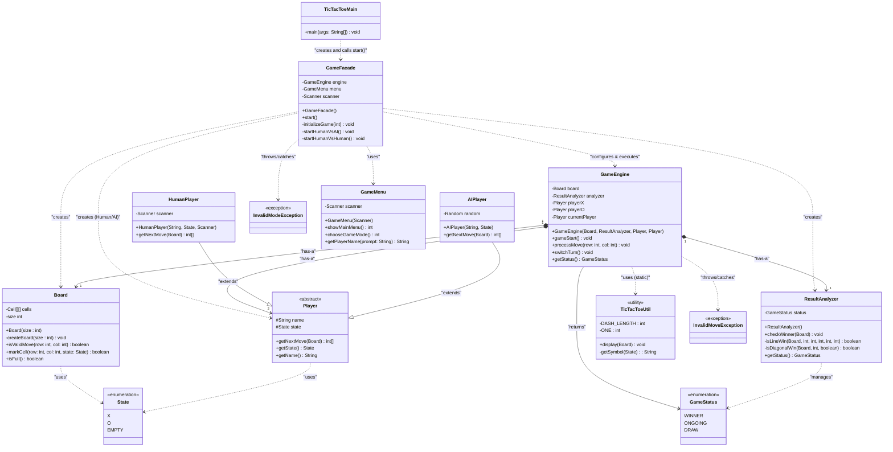

# Tic-Tac-Toe Application - UML Class Diagram

## Overview

This document represents the class structure of the Tic-Tac-Toe game implemented using the **Facade Design Pattern**.

---

## Class Diagram

